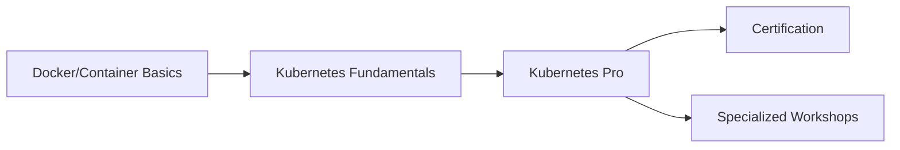

# Course Portfolio

Welcome to our comprehensive Kubernetes training program.

## Our Training Courses

Master Kubernetes with our expert-led, hands-on training courses designed for professionals at every level.

### [Kubernetes Fundamentals - 2 Days](./kubernetes-fundamentals.md) 🚀

Perfect for getting started with Kubernetes container orchestration.

**What you'll learn:**

- Kubernetes architecture and core concepts
- Pod, Service, and Deployment management
- Basic networking and storage
- Troubleshooting fundamentals
- CKA certification preparation basics

**Duration:** 2 days (16 hours)  
**Prerequisites:** Basic container and Docker knowledge  
**Ideal for:** Developers, System Administrators, DevOps beginners

### [Kubernetes Pro - 3 Days](./kubernetes-pro.md) ⚡

Advanced course for experienced practitioners ready for production-grade implementations.

**What you'll master:**

- Advanced security and RBAC
- Complex networking
- Production monitoring and observability
- Multi-cluster management
- Advanced troubleshooting

**Duration:** 3 days (24 hours)  
**Prerequisites:** Kubernetes Fundamentals + 3+ months experience  
**Ideal for:** Senior Engineers, Architects

## Learning Path

## Certification Preparation

Our courses prepare you for industry-recognized certifications:

- **CKA** (Certified Kubernetes Administrator)
- **CKAD** (Certified Kubernetes Application Developer)  
- **CKS** (Certified Kubernetes Security Specialist)

## Training Formats

### Public Courses

- Scheduled group sessions
- In-person or live online
- Interactive learning environment
- Networking with peers
- Cost-effective option

### Private/Corporate Training

- Customized curriculum
- On-site or remote delivery
- Flexible scheduling
- Team-focused exercises

## Why Choose our Courses?

✅ **Expert Instructors** - Certified professionals with production experience  
✅ **Hands-On Focus** - Part lecture, part discussion, exercises and heavy hands-on practice.  
✅ **Real-World Scenarios** - Based on actual production challenges  
✅ **Ongoing Support** - Post-course assistance on Kubernetes resources  
✅ **Industry Recognition** - Trusted by leading companies worldwide

## Get Started

Ready to advance your Kubernetes skills?

1. **Choose Your Level** - Start with Fundamentals or jump to Pro
2. **Check Schedule** - View upcoming course dates
3. **Enroll** - Secure your spot today
4. **Prepare** - Receive pre-course materials
5. **Learn** - Join expert-led training with hands-on labs

## Contact Information

**Training Inquiries:** [contact@qedzone.ro](mailto:contact@qedzone.ro)  
**Enterprise Solutions:** [contact@qedzone.ro](mailto:contact@qedzone.ro)  
**Phone:** +40 725 347 822

[Contact Us](../contact) | [About Us](../about)
